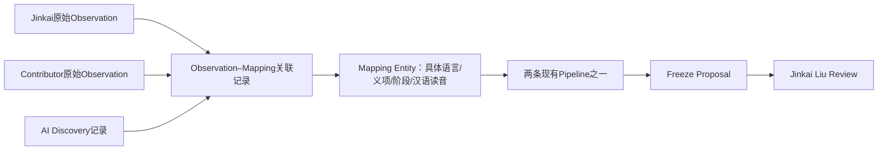

# Human–AI Research Queue v0.1

状态：Design Proposal，等待Jinkai Liu审核。未实施Scheduler、未接收Batch003、未修改schema/产品/benchmark。

**Automation must reduce research labor, not erase human authorship.** 自动化减少研究劳动，不抹去人的原创贡献。

Batch003已经完成，作为最后一次旧式逐批人工指令监督的研究批次；不重新选八条、不重复研究。后续可自动执行的是研究劳动，Jinkai Liu的编辑审核并不取消。

## 1. Three-Inbox model

三个入口共用一套研究队列，但原始来源永远分开。

| Inbox | 原始记录 | 必须保留的区别 |
|---|---|---|
| Human Original Observation | Jinkai Liu原始文字、语音/附件的原始文件及出处 | `origin=human_original`；只有经身份确认的提交才署名Jinkai Liu，旧来源不明记录不得自动归给他 |
| Contributor Observation | 其他人工贡献者原文 | `origin=contributor_original`；稳定contributor ID与显示署名独立，不把AI润色算作原作者文字 |
| AI Discovery | AI run输出、输入范围、方法、候选与反例 | `origin=ai_discovery`；另标independence状态，不保证凡AI生成就独立发现 |

用户可直接投递未整理的短句、拼音串、照片或文学笔记。Source identity尚不明也应先接住原文；能否进入研究在后续Gate判断，不能为使输入整齐而丢弃它。

### 人工Observation的逻辑记录

以下是设计契约，**不是已经添加的schema字段**：

| 字段 | 约束 |
|---|---|
| Observation ID | 稳定唯一ID；与Candidate ID、Mapping ID不同 |
| Original text / original asset reference | 原始内容独立保存；转录、翻译、OCR是派生记录，不覆盖原件 |
| Author / Contributor identity | 稳定身份ID、显示名、身份核验状态；unknown可以保留 |
| Created/source date | 原材料记载的日期，含来源与精度；不知道则null，禁止用今天替代 |
| Received / frozen at | 系统实际接收与封存UTC时间；与作者声称创作日分开 |
| Source / provenance | 原文件/消息ID、版本、位置、附件hash、来源取得方式 |
| Source word/form | 原文明确内容照录；AI解析另存，未知不猜 |
| Proposed Chinese mapping | 可缺省；保留原字形、原读音及错误，规范读音另层保存 |
| Author reasoning | 原作者明确写出的理由；没有则空，不让AI补写成作者想法 |
| Possible mapping type | 作者自述与AI建议分开；多义仍待审核 |
| Literary/cultural note | 作者原文；不作为历史证据 |
| Research status | 队列/身份待核/研究中/待审核/归档等；不修改作者身份 |

原文永久独立保留指产品不因normalize、merge、reject、archive而静默覆盖/删除。作者更正追加新版本、`supersedes`及原因，旧版可追溯；合法删除/撤回请求另按数据治理规则执行，不能承诺技术上绝不删除。

### AI Discovery记录

保存run ID、实际可知的model/version（未提供就Unknown）、时间、方法版本、source inputs及hash、所见上下文/作者目标暴露状态、candidate forms、引用/evidence status、controls、counterexamples、shortlist版本。

AI发现与AI辅助不同：

- `independence=unverified`为默认。
- 已读作者Mapping、其推导字段或旧Featured：`independence=author_exposed / assisted`。
- 只有隔离输入、曝光日志、冻结顺序和独立裁定均充分，才可标`independently_generated`；这仍不等于blind benchmark通过或历史同源。
- 同一run内先看作者答案再提出相同汉字，不得记作独立复现。

本轮对话中已有的示例只用于设计说明，**不能作为新的AI-unexposed holdout**。

## 2. Provenance Freeze在Normalization之前

生产顺序：

`Raw Observation → Provenance Freeze → Normalization → Deduplication → Family Detection → Pipeline Routing → Research Queue`

1. 接收原始字节/文本，不先纠错、改拼音、补词源。采集真实received时间、作者身份声明、source定位与附件。
2. 非生成式接收服务计算内容hash，生成不可覆写版本和manifest；分离原材料日期与系统日期。
3. 保留封存副本和追加式事件日志。Checksum证明内容一致，不证明作者是谁、内容何时最初产生或证据正确；历史优先权不能靠hash单独认证。
4. AI只在权限允许后读取副本，输出normalized interpretation并指向原Observation版本。每个AI补充字段写清`derived_by`与run，不把推测回写raw。
5. 同样适用于AI产出的首次记录：冻结初始输出后再整理，不把后续证据发现倒写成最初候选。

建议保留source-derived日期、ingestion时间、内容hash、身份认证/来源可信度四种独立信息。没有确切日期时只能说“最早可验证记录”，不能认定“谁全世界最先想到”。

## 3. Mapping Entity ↔ Observation

一个研究对象可以连接多个提出者，且一条笔记可能提出多个Mapping。

### Mapping identity

不能只以source spelling或“同一汉字”合并。身份至少比较：source语言/lexical identity、source sense/unit/stage、Chinese form+reading+sense、比较类型与适用范围。相同拼写的不同词义、不同历史阶段、标准翻译与文学链分别处理。

先建立provisional mapping ID；历史单位/读音未定时不伪造确定key。合并后旧ID保留redirect；误合并可拆分，原Observation不变。

### 关联记录最小信息

`mapping_ref + observation_id/version + role + claim_scope + independence_status + exposure_reference + adjudication_reference`

role区分original proposal、independent observation（待裁定）、AI refinement、counterexample、evidence contribution。Contributor提供了词典引文，不因此成为原Mapping作者；AI补证也不取得原始观察署名。

多个Observation可以共享Mapping Entity，但不共享证据等级。每条保留作者、原文、版本与曝光史。仅内容相同不证明独立；时间先后不证明没有相互影响。编辑审核决定是否可以展示“independently observed”。

去重只减少重复研究任务，**不减少作者记录**。同一作者反复提交可标duplicate submission并关联；不同作者提出同一观察不得覆盖先前provenance。反对同一Mapping的记录也应关联，不只收集支持者。

## 4. Future Human Holdout workflow

关键分叉在AI可读Normalization之前。

### 封存分支

`Human submission → 非LLM原样接收/时间戳/hash → sealed original → 人工或可信隔离管理员资格裁定 → Future Human Holdout Candidate`

默认先标`exposure unknown / sealed pending eligibility`，不能凭“刚收到”断言从未被AI看过。作者可声明此前是否使用AI；日志只能证明受控系统内访问，不证明全世界未见。

新的、明确source↔Chinese目标、来源可核、没有已知AI辅助/曝光的记录，可成为**Future Human Holdout Candidate**，不自动成为benchmark gold。封存目标不进入LLM索引、embedding、搜索片段、工具返回、自动摘要或一般日志；排除清单只含不泄露目标的ID/必要安全元数据。

未来若有真正隔离Evaluator，可仅提供sanitized source packet，冻结独立shortlist后reveal。曝光是按worker/context/run记录：管理封存包的人可以见到目标，但不能兼任blind worker；同一run已见目标永远不能清除污染标签。

### 生产分支

选择Production意味着目标可供研究worker查看；先写exposure事件，再开放内容，标`Benchmark-ineligible after production exposure`，保留原作者贡献和原始封存版本。

Holdout不得同时进入Production。需要由Jinkai/指定管理员明确release；不能因为队列缺8条自动取出。研究后的结果不能倒填为pre-AI target。

**当前环境不具备已验证的隔离Evaluator。** Benchmark继续Designed / Frozen / Execution Pending Isolated Evaluator；本设计不改变这个状态。普通聊天里贴出的作者目标已被当前AI看到，不能由当前agent补一个hash便声称未曝光。未来未曝光入口需要独立非LLM接收/封存机制，尚未实施。

## 5. Research Queue与有界AI生产

两个Primary Pipeline不变：Lexical–Diachronic / Cultural–Structural–Literary。三Inbox是来源分类，不是第三条pipeline。

调度复用Batch003 Scheduler设计，追加以下来源规则：

- Human notes是永久一级入口，不要求作者按字段填表；原文先保存，AI承担整理与核验。
- 待研究项只能来自已登记Inbox/queue或明确授权的AI Discovery主题。不能为填满batch无限造词、以Featured数量优化选样。
- AI即使无人新投稿也可以消化获准backlog。需要拓展新词时，必须在主题、来源集合、每轮数量/时间、重复检测、成本与审核backlog预算内生成；预算外停下，不自动无限扩大研究域。
- 默认仍8条；设计允许配置8–12，但扩至9–12是未来审核参数，不是本轮已批准扩容。
- 选样保证人工笔记不会被AI队列淹没：记录来源覆盖与等待时长，优先保护久候人工投稿；具体配额由Jinkai决定，不因Author身份提高证据评分。
- Source Identity Gate检查form/language/identity/context/provenance。身份未知形成Archive/Provenance unresolved提案，原文不删除、不从期待的汉字反推来源。
- 固定候选上限、停止条件、引用与controls。输出仅到Freeze Proposal；无自动接收和页面生成。

## 6. Jinkai Liu Review Gate与状态分离

至少独立保存这些状态轴：origin/author、provenance confidence、AI exposure、research status、evidence status、featured selection、candidate/reviewed/publication状态。

允许“Jinkai原始观察 + Evidence Pending”，也允许“AI发现 + Strong scoped evidence”。Neither origin determines evidence quality。

审核操作绑定batch/record版本及manifest checksum：Accept as canonical candidate、Keep Pending、Request bounded verification、Archive。改动已核原文或结论必须生成新版本，原批准不覆盖未知新内容。

`Freeze Proposal → Jinkai Review → Canonical Candidate → Reviewed → Published`

箭头表示可授权的阶段转换，不是定时自动升级。接收Candidate不自动Reviewed/Published；Featured Pending不阻止接收。Published Featured必须由Jinkai明确决定；不能由worker、schema validation或AI作者身份替代。

研究worker没有corpus/page/git/deploy权限；未来接收worker按显式批准范围执行。审批可一次覆盖一批，但必须列出可接收记录及版本。Archive保留provenance。

## 7. Automation vs Human Responsibility

| 工作 | 自动化可以做 | 人工责任 / 硬边界 |
|---|---|---|
| 原文接收与封存 | 非LLM保存、ID、hash、系统时间 | 身份/旧材料日期有疑点时人工确认；不伪造作者 |
| Normalize | 建议form、读音、类型，生成带归属的派生字段 | 歧义裁定；不得覆盖raw |
| Duplicate detection | exact/sense候选匹配、合并任务建议 | 多作者provenance不可删除；复杂merge/split审核 |
| Family detection | 提供词源引文或possible family | 仅拼写相似不能确认为历史族 |
| Routing/priority | 两pipeline路由、source多样性和等待时长 | 文学身份、专题/预算、长期优先级由Jinkai决定 |
| Candidate research | 有界候选、检索、反例、分维度评分建议 | 证据适用范围、作者归属、Featured价值最终审核 |
| Holdout | 非LLM封存及访问控制、ID排除 | 资格预注册与release；隔离失败不运行blind evaluation |
| Independence claim | 汇总时间、输入/访问日志 | 独立性/复现等价需独立裁定；不能由生成者自行认证 |
| Validators | 格式、引用、非法状态升级、已知边界 | 不能替代真实性和历史语言学审核 |
| Candidate acceptance | 审核后按限定版本执行 | Jinkai授权；Canonical≠Reviewed≠Published |
| Publication | 另行授权的产品流程 | 不由研究Scheduler自动决定Published Featured |

## 8. 设计验收场景（未实现测试）

1. Jinkai随手输入有错拼音的raw note：保存原文，normalized纠正独立署名AI；不能覆写作者原文。
2. 两位contributor提出同一Mapping：一个研究对象，两个Observation与出处；未证实独立时只称多来源记录。
3. AI看过作者目标后提同一字：保存AI refinement，不称blind rediscovery。
4. 新笔记进入holdout：Normalization/search/embedding前即隔离；无隔离机制则标无法保障，不开展盲测。
5. AI研究证据强于作者候选：保留两条来源，分别评分；作者不会因降级而失去署名。
6. 研究队列为空：停止或在已批准主题预算内提出新AI Discovery记录；不无限找词。
7. 原文归档：仍可追溯，状态不是删除；新证据可提reopen但不篡改旧版。
8. Candidate被接受：不自动Reviewed/Published；Featured可Pending。

## 9. Schema结论与交付边界

详见[compatibility report](schema-compatibility.md)。现有历史/Mapping/evidence模型继续复用。现有结构缺少有身份、有版本、有角色的多Observation关系；建议未来新增**Queue层Observation registry + Mapping–Observation links**最小契约，优先仓库外/sidecar关联，不立即改canonical entry schema。

旧entry作者固定为Jinkai Liu，不能把contributor/AI Mapping塞进去然后继承该署名。未来Publication若进入该旧格式，应先明确collection/editor与observation author的区别并审定兼容性调整，当前不改42条。

本设计不实施数据表、Scheduler、Inbox、holdout服务或任何新的自动化。Batch003成果保持冻结；等待Jinkai Liu审核。
